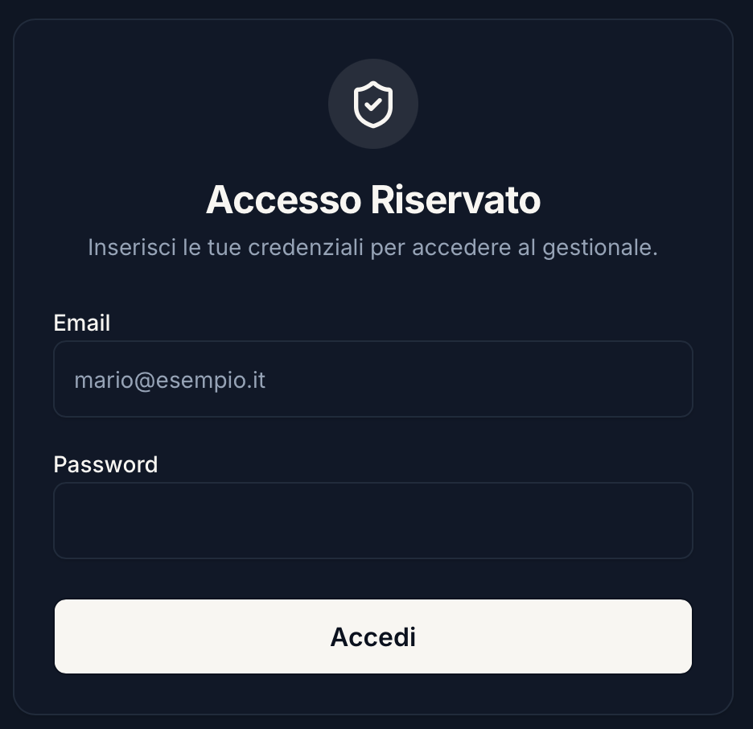

# 🗂️ Task & Policy Manager (Gestionale Assicurativo)

Un gestionale web moderno, veloce e sicuro, sviluppato su misura per ottimizzare la produttività quotidiana di un agente assicurativo. 
Creato per semplificare la gestione del portafoglio clienti, unisce la potenza di un sistema in cloud a un'interfaccia premium e ultra-rapida.

---

## ✨ Perché questo tool?

Il lavoro di un assicuratore richiede la costante attenzione su molteplici fronti: scadenze imminenti, pratiche da emettere, sinistri in corso di liquidazione e incombenze quotidiane. Questo tool elimina il disordine di appunti sparsi e vecchi fogli di calcolo, fornendo un unico hub centrale in cui:
- Avere sempre sott'occhio le **urgenze**.
- Modificare lo **stato delle pratiche in un click**.
- Lavorare in totale mobilità, grazie alla **sincronizzazione in cloud** su PC, Tablet e Smartphone.

---

## 🚀 Funzionalità Principali

### 📊 Dashboard Intelligente
Una schermata principale che restituisce il polso della situazione in tempo reale:
- **Contatori riassuntivi** per Attività, Polizze Personali, Preventivi e Sinistri attivi.
- Box **Urgenze** che raggruppa dinamicamente le attività scadute e le polizze in scadenza a brevissimo termine, garantendo che nulla sfugga.


### 📑 Gestione Polizze Personali
Il cuore del portafoglio clienti per una gestione reattiva delle scadenze:
- **In Scadenza**: Elenco completo delle polizze attive emesse, ordinate cronologicamente.
- **Da Emettere**: Una "to-do list" dedicata per tenere traccia delle polizze in fase di preventivazione o in attesa di emissione. Segnare una polizza come emessa la archivia/elimina istantaneamente dopo conferma.
- **Badge di Cassa Interattivi**: Modifica istantanea dello stato contabile (*Da mettere a cassa, In cassa, Regolare, Pagata*) tramite menu a tendina integrati nelle card. Contrassegnare una polizza come *Pagata* ne confermerà l'eliminazione definitiva, mantenendo lo spazio di lavoro pulito.
- **Inserimento Intelligente (Quick Add)**: Inserisci le polizze digitando semplicemente "Nome Cliente - Tipo Polizza". Il sistema compilerà automaticamente i campi, offrendo suggerimenti per i rami più comuni e gestendo anche le note.


### 💼 Gestione Preventivi e Vendite
Un modulo dedicato per tracciare le trattative in corso e le offerte presentate ai clienti:
- **Flusso a Fasi**: Classificazione tra preventivi *Da Fare* e preventivi *Consegnati*. I preventivi *Accettati* vengono convertiti ed eliminati definitivamente per mantenere pulito lo spazio di lavoro.
- **Raggruppamento Dinamico**: I preventivi sono raggruppati cronologicamente per giorno di creazione con divisori grafici.
- **Quick Add Multifunzionale**: Inserimento istantaneo con Tipo Polizza, Premio, Data personalizzata e Note in un'unica barra veloce.


### 🚗 Gestione Sinistri Avanzata
Un intero modulo per seguire il ciclo di vita dei sinistri:
- Tracciamento visivo tramite **stati colorati**: *Da aprire, Aperto, Incaricato il perito, Non liquidato, Liquidato*.
- Automazione intelligente: la data di apertura si autocompila istantaneamente nel momento in cui il sinistro passa dallo stato di pre-apertura ad uno stato attivo.
- Liquidazione sicura: marcare un sinistro come *Liquidato* chiude la pratica rimuovendola in totale sicurezza (previo popup di conferma).


### ✅ Attività e Promemoria (Da Fare)
- Barra di "Quick Add" per l'aggiunta rapida con invio diretto e possibilità di specificare date di scadenza.
- Gestione distruttiva sicura: segnare un'attività come completata la cancella dall'elenco (previo popup di conferma).
- Possibilità di aggiungere note rapide alle attività direttamente in lista.


### 🔒 Accesso Sicuro (Login)
Ogni agente dispone di un account protetto per tutelare la privacy e la sicurezza delle informazioni dei clienti:
- **Autenticazione Firebase**: Login sicuro basato su email e password.
- **Isolamento dei Dati**: I dati salvati su Cloud Firestore sono vincolati all'identificativo univoco (`uid`) dell'agente, garantendo che nessuno possa accedere alle informazioni altrui.



### ☁️ Sincronizzazione in Cloud (Firebase)
- **Zero perdite di dati**: Addio salvataggi in locale. Il sistema si basa ora su Firestore, garantendo che ogni aggiornamento avvenga in tempo reale sui server cloud.
- **Sicurezza Assoluta**: Accesso ristretto tramite Firebase Auth. Ogni utente accede solo ed esclusivamente ai propri documenti crittografati.

---

## 🧰 Stack Tecnologico

Il gestionale poggia su tecnologie moderne ed estremamente performanti:

- **Frontend**: React.js + TypeScript
- **Build Tool**: Vite (per un'esperienza di sviluppo ultra-veloce)
- **UI/UX Design**: Tailwind CSS + shadcn/ui (Radix UI) con animazioni fluide e design glassmorphism.
- **Routing**: wouter
- **Stato & Fetching**: TanStack React Query + Hook reattivi per i Realtime Snapshot.
- **Backend & Database**: Firebase Authentication e Cloud Firestore (Serverless).

---

## 🚀 Guida all'Avvio Locale (Per Sviluppatori)

### 1) Prerequisiti
Assicurati di avere installato **Node.js** e **pnpm**.
```bash
npm install -g pnpm
```

### 2) Clonare e Installare
```bash
git clone <URL_REPO>
cd Task-Policy-Manager
pnpm install
```

### 3) Configurazione Firebase
Crea un file `.env.local` nella cartella `artifacts/gestionale/` contenente le chiavi del tuo progetto Firebase:
```env
VITE_FIREBASE_API_KEY=tua_api_key
VITE_FIREBASE_AUTH_DOMAIN=tuo_dominio.firebaseapp.com
VITE_FIREBASE_PROJECT_ID=tuo_project_id
VITE_FIREBASE_STORAGE_BUCKET=tuo_storage_bucket
VITE_FIREBASE_MESSAGING_SENDER_ID=tuo_sender_id
VITE_FIREBASE_APP_ID=tuo_app_id
```

### 4) Avviare l'Applicazione
Lancia il comando di avvio per far partire il server di sviluppo:
```bash
pnpm --filter @workspace/gestionale dev
```
Apri nel browser l'indirizzo indicato (di norma `http://localhost:5173`) per usare l'applicazione in locale.

---

## 🔒 Sicurezza e Privacy
Il codice sorgente è progettato per prevenire il caricamento accidentale di API keys e segreti. Assicurati che i file `.env.*` rimangano inseriti nel `.gitignore` locale per prevenire esposizioni su GitHub. La base dati Firestore associa dinamicamente e univocamente le informazioni all'UID generato in fase di login, assicurando il massimo grado di privacy sui dati dei clienti.
